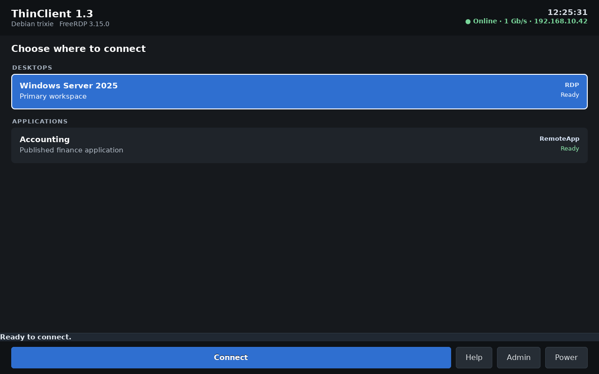
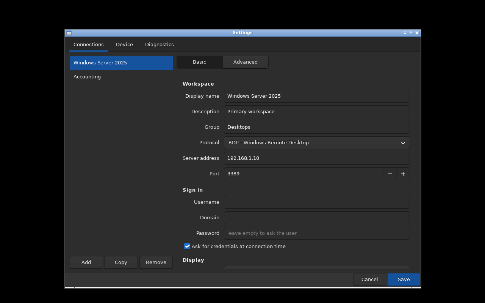
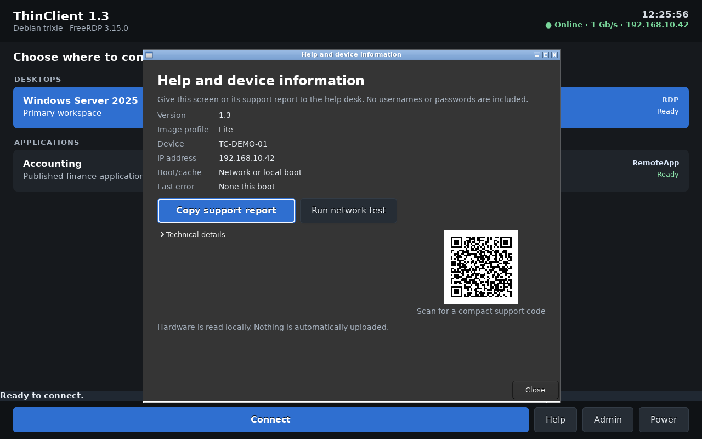
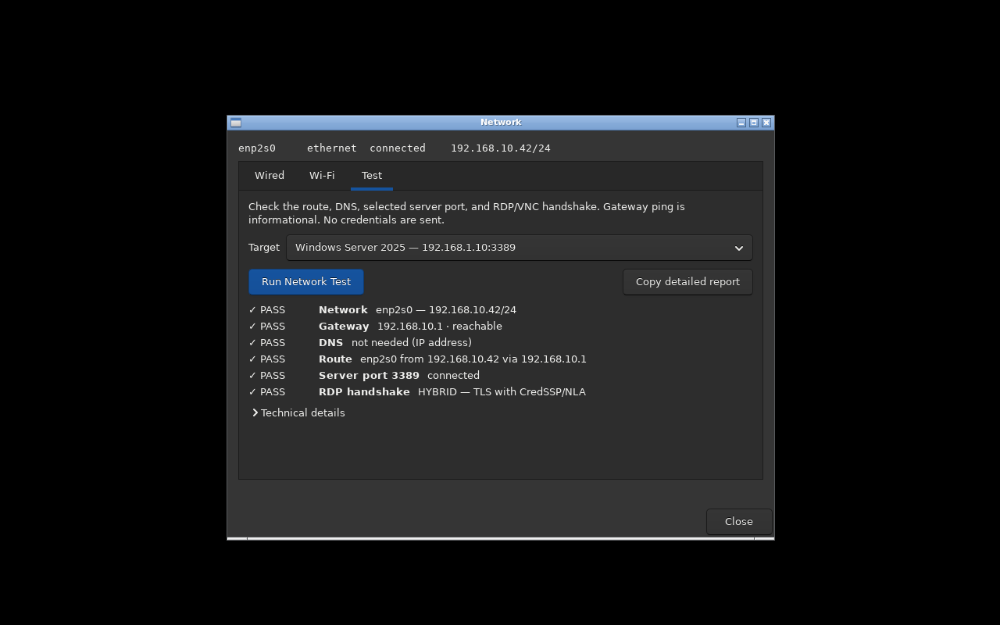

<div align="center">

<h1>ThinClient</h1>

<p><strong>A small, immutable Debian appliance for RDP, RemoteApp, and VNC sessions.</strong></p>

<p>Turn a compatible x86-64 PC into a focused endpoint that boots, presents the<br>
approved connections, and gets out of the user's way.</p>

<p>
  <a href="build/config.sh"></a>
  <a href="https://www.debian.org/"></a>
  <a href="https://www.freerdp.com/"></a>
  <a href="LICENSE"></a>
</p>

<p>
  <a href="#building">Build</a> ·
  <a href="#deploying-by-usb">USB</a> ·
  <a href="#installing-to-a-clients-internal-disk">Internal disk</a> ·
  <a href="#deploying-by-pxe">PXE</a> ·
  <a href="#configuration">Configure</a> ·
  <a href="#troubleshooting">Troubleshoot</a>
</p>

</div>



<p align="center"><sub>The connection manager from the verified 1.3 build.</sub></p>

ThinClient boots from USB, an internal disk, or PXE. Its operating system lives
in a read-only squashfs with ephemeral runtime state, so a fleet returns to the
same known image at every boot. Configuration can be local, stored on a small
`TCCONF` partition, or delivered centrally over the network.

```text
power on ──▶ BIOS / UEFI / Secure Boot ──▶ connection manager ──▶ RDP or VNC
                                                    ▲                  │
                                                    └── session ends ──┘
```

## Why use it?

| Capability | What you get |
|---|---|
| Appliance experience | Full-screen GTK workspace cards, grouping, visible state, and cancellable kiosk auto-connect; no desktop shell or application menu. |
| Local identity | Public Help view with version, image profile, IP, cache state, last error, static hardware, copyable report, and offline QR support code. |
| Guided network test | Visual and copyable, credential-free route, DNS, TCP, RDP, and VNC preflight from Help or the administrator Network window. |
| Windows-ready sessions | FreeRDP 3, RemoteApp, RD Gateway, NLA/TLS, Kerberos preparation, multi-monitor, dynamic resolution, and reconnect policy. |
| Device redirection | Audio output, microphone, clipboard, printers, smart cards, USB storage, and optional raw USB redirection. |
| Flexible deployment | One hybrid image for legacy BIOS, UEFI, and Secure Boot; install locally or boot a diskless fleet over PXE. |
| Central management | Layered JSON configuration from the image, `TCCONF`, kernel/DHCP URL, and per-boot local edits. |
| Guard rails | Unprivileged kiosk account, administrator-gated tools, validated installer targets, atomic privileged writes, and fail-closed configuration handling. |
| Release verification | Unit, permission, RDP, GTK, BIOS, UEFI, Secure Boot, shutdown, installer, and PXE tests run against the built image. |

## Quick start

On Debian or Ubuntu (including Debian under WSL2):

```bash
git clone https://github.com/patnawa/Thinclient.git
cd Thinclient
sudo bash build/build.sh
sudo bash build/verify-all.sh
```

The result is `out/thinclient-amd64-1.3.iso`. See [Building](#building) for host
prerequisites and site-specific defaults, then choose [USB](#deploying-by-usb),
[internal disk](#installing-to-a-clients-internal-disk), or
[PXE](#deploying-by-pxe) deployment.

## Repository layout

| Path | What it is |
|---|---|
| `build/` | The image builder plus its verification tools. Run on Debian/Ubuntu (WSL2 is fine). |
| `overlay/` | Everything that gets laid on top of the base Debian filesystem. |
| `pxe/` | Network-boot helpers and sample server configuration. |
| `deploy/docker-pxe/` | TFTP + HTTP Docker Compose deployment for a Debian PXE host. |
| `docs/PROJECT-ROADMAP.md` | Durable release checklist, design guardrails, and prioritized improvements. |
| `out/` | Build output: the ISO, the PXE tree, and test screenshots. Created by the build. |

---

## What is in the image

| | |
|---|---|
| Base | Debian 13 (trixie), kernel 6.12 LTS |
| RDP client | FreeRDP 3 (`xfreerdp3`) |
| VNC client | TigerVNC (`xtigervncviewer`), optional via `INCLUDE_VNC` |
| Graphics | X11 + Openbox, no desktop environment |
| UI | GTK3 connection manager with friendly grouped cards, staged connection progress, actionable errors, public Help, and administrator-gated tools (`overlay/usr/local/lib/thinclient/`) |
| Audio | PipeWire, playback **and** microphone redirection |
| Redirection | Multi-monitor, USB storage, smart cards, printers, clipboard |
| Network | NetworkManager, static/DHCP, broad wired/USB Ethernet drivers, and Intel/Realtek/Qualcomm/Broadcom/MediaTek Wi-Fi firmware |
| Boot | Hybrid ISO: BIOS (isolinux) + UEFI (GRUB), Secure Boot via Debian's signed shim |

No general-purpose desktop applications are installed. There is no browser,
file manager, or desktop menu—the Openbox right-click menu is deliberately empty
so there is no way out of the appliance.

<details>
<summary><strong>Settings UI</strong></summary>



The administrator-gated editor keeps names, endpoints, credentials, and display
mode on a Basic page. Security, graphics, redirection, RemoteApp, and reconnect
policy remain available on Advanced.

</details>

<details>
<summary><strong>Help and device information</strong></summary>



The public Help view shows the version, Lite/Full image profile, IP, USB-cache
state, and last connection error. It can copy a credential-free report, run a
safe network test, and display a compact offline QR support code. Full static
hardware details remain behind the Technical details expander.

</details>

<details>
<summary><strong>Guided network test</strong></summary>



The on-demand test follows the selected connection's real endpoint, including
its effective port or RD Gateway. It reports the local route, an informational
gateway ping, DNS, TCP reachability, and a credential-free RDP/VNC handshake.

</details>

---

## Building

### Prerequisites

A Debian or Ubuntu machine — a WSL2 distro on Windows works and is what this was
built on:

```powershell
wsl --install -d Debian
```

Then, inside it as root:

```bash
apt update
apt install -y --no-install-recommends \
    debootstrap squashfs-tools xorriso isolinux pxelinux syslinux-common \
    grub-pc-bin grub-efi-amd64-bin grub-common mtools dosfstools \
    ca-certificates rsync file curl python3
```

You need about 8 GB of free space and an internet connection to `deb.debian.org`.

### Build

```bash
sudo bash build/build.sh
```

Verify the completed artifact before deployment:

```bash
(cd out && sha256sum -c thinclient-amd64-1.3.iso.sha256)
```

First build takes 15–30 minutes (it downloads a full Debian base plus packages).
Later builds reuse the bootstrap and take a few minutes; pass `REBUILD_BASE=1` to
start clean.

When changing an `INCLUDE_*` feature from `1` to `0`, use `REBUILD_BASE=1` if
you also need its cached packages removed from the artifact. Service gates still
honour the flag on an incremental build.

Site-specific values — your real server address, your time zone — go in
`build/config.local.sh`, which is untracked:

```bash
# build/config.local.sh
DEFAULT_SERVER=192.168.1.50
DEFAULT_DOMAIN=CORP
```

That keeps the tracked defaults generic, so a checkout never carries one site's
addresses into another's, and nothing internal ends up in a public repository.

Build knobs live in `build/config.sh` and can be overridden per run:

```bash
sudo DEFAULT_SERVER=10.0.0.20 DEFAULT_TIMEZONE=Asia/Bangkok \
     INCLUDE_PRINTING=0 bash build/build.sh
```

| Variable | Default | Effect |
|---|---|---|
| `DEFAULT_SERVER` | `192.168.1.10` | Server address baked into the factory config |
| `DEFAULT_TIMEZONE` | `Asia/Bangkok` | Client time zone (matters for Kerberos) |
| `DEFAULT_KEYMAP` | `us` | Keyboard layout |
| `INCLUDE_PRINTING` | `1` | CUPS stack for printer redirection (~150 MB) |
| `INCLUDE_SMARTCARD` | `1` | PC/SC daemon for smart card redirection |
| `INCLUDE_USB_REDIR` | `1` | Raw USB device redirection |
| `INCLUDE_WIFI` | `1` | NetworkManager Wi-Fi tools and regulatory database |
| `INCLUDE_WIFI_FIRMWARE` | `1` | Intel, Qualcomm/Atheros, Broadcom/Cypress, and MediaTek Wi-Fi firmware (~112 MiB in the ISO); core Realtek firmware remains installed for wired NICs |
| `INCLUDE_SOF_FIRMWARE` | `1` | Intel Sound Open Firmware for newer systems; Ivy Bridge/Haswell use legacy HDA audio |
| `INCLUDE_AMD_MICROCODE` | `1` | AMD CPU microcode; Intel microcode remains part of the core wired-client image |
| `INCLUDE_SECUREBOOT` | `1` | Signed shim so Secure Boot can stay on |
| `INCLUDE_ADMIN_TOOLS` | `1` | xterm, ssh client, htop for on-site support |
| `INCLUDE_SSH_SERVER` | `1` | Install key-only remote support; port 22 stays closed until a key exists on `TCCONF` |
| `SUPPORT_AUTHORIZED_KEYS_FILE` | empty | Public-key file to seed as `TCCONF/support/authorized_keys` |
| `ENABLE_USB_CACHE` | `1` | Add a checksum-verified removable `TCCACHE` fallback for PXE root images |
| `CACHE_LABEL` | `TCCACHE` | Dedicated FAT32, exFAT, or ext4 USB partition label |
| `CACHE_PROFILE` | `default` | Cache namespace; the profile wrappers set this to `lite` or `full` |
| `TCCONF_SIZE_MB` | `64` | Writable FAT32 settings partition embedded in raw-written USB images (`0` disables it) |
| `INITRAMFS_MODULES` | `most` | Initramfs driver policy; the Lite PXE profile uses a tested wired-NIC and USB-storage list |

### Smaller image for older wired PXE clients

Ivy Bridge and Haswell-era OptiPlex systems do not benefit from modern Wi-Fi,
SOF audio firmware, AMD microcode, printing, smart-card, VNC, raw-USB, SSH, or
admin-tool packages. Build the wired RDP profile with:

```bash
sudo bash build/build-lite-pxe.sh
```

Its artifacts are written to `out/lite/`. The profile keeps Intel,
Realtek and Broadcom wired NIC support, Intel graphics through Xorg's modesetting
driver, RDP audio, BIOS and UEFI boot, Secure Boot, and the optional installer.
It also changes the TFTP initrd from `MODULES=most` to an explicit set of
common desktop and USB Ethernet drivers; all other kernel modules remain available
after the HTTP squashfs becomes the root filesystem.

This profile is intended for centrally configured, wired PXE clients. Use the
standard image when Wi-Fi, printing, VNC, smart cards, raw USB redirection,
remote SSH support, or persistent USB `TCCONF` storage is required.

Before building — or after editing anything — run the static checks:

```bash
bash build/check.sh
```

### Output

```
out/
  thinclient-amd64-1.3.iso     hybrid ISO: burn it, or dd it to a USB stick
  thinclient-amd64-1.3.iso.sha256  exact release integrity/identity digest
  pxe/
    thinclient/vmlinuz
    thinclient/initrd.img
    thinclient/filesystem.squashfs
    pxelinux.0, pxelinux.cfg/default        BIOS netboot
    grub/grub.cfg, bootx64.efi              UEFI netboot
    boot.ipxe                               iPXE script
    render-configs.sh, make-uefi-netboot.sh
    dnsmasq-thinclient.conf, Set-WindowsDhcpPxe.ps1
```

### Verifying a build

The release verifier runs the checks below in failure-cost order. Each check is
also usable on its own, and none requires client hardware.

```bash
sudo bash build/verify-all.sh        # everything below, cheapest failures first
sudo BUILD=1 bash build/verify-all.sh   # ...rebuilding first
```

Or individually:

| Command | What it proves |
|---|---|
| `bash build/check.sh` | Syntax: shell, Python, JSON, XML, systemd units |
| `bash build/imagecheck.sh` | Hybrid MBR/GPT layout, embedded `TCCONF`, and baked configuration |
| `sudo bash build/networkcheck.sh` | Common Ethernet/USB drivers, initramfs coverage, wireless stack, and firmware |
| `sudo bash build/supportcheck.sh` | Missing/invalid keys keep SSH closed; valid keys get hardened access and stable identity |
| `sudo bash build/unittest.sh` | Unit tests for the configuration core (see below) |
| `sudo bash build/permcheck.sh` | **Runs as the kiosk user**: sudo rules, `/run` writability, save/delete round-trip |
| `sudo bash build/rdpcheck.sh` | Every FreeRDP option we emit exists in the shipped binary |
| `sudo bash build/rdpsession-test.sh` | A real RDP session, client taken from the image |
| `sudo bash build/uitest.sh out/ui.png [settings\|about\|network-test\|admin\|progress\|error]` | The GTK screens render; set `TC_UI_SCREEN=1024x768` for the old-monitor lane |
| `sudo bash build/boottest.sh bios\|uefi\|secureboot\|debug` | Boots in QEMU, timed screenshots |
| `sudo bash build/shutdowntest.sh` | Drives the Shut Down button and checks the machine really powers off |
| `sudo bash build/installtest.sh bios\|uefi` | Installs to a blank virtual disk, removes the ISO, and boots the installed system |
| `sudo bash build/pxetest.sh bios\|uefi` | PXE-boots a diskless client and proves squashfs plus central config were fetched |
| `python3 test/probe_rdp_server.py <host>` | What security protocol your RDP server demands (no logon attempted) |

Two of these earn their keep:

**`permcheck.sh` runs as `thin`, not root.** The connection manager is
unprivileged, and testing it as root hides the faults that actually bite — a
root-only `/run` directory, a missing `sudo`, a sudoers rule that does not cover
the command the UI calls. Every one of those shipped in the first build of this
image precisely because the UI test ran as root.

**`rdpcheck.sh`** is worth re-running after any Debian upgrade. FreeRDP renames
options between releases, and this checks against the binary that shipped rather
than against documentation.

`boottest.sh debug` boots the diagnostic entry, which redirects the console to
the serial port; `out/boottest-debug/serial.log` then contains boot timings,
the slowest units, the active X driver and any errors.

### Unit tests

`tests/` uses stdlib `unittest` to cover the configuration core, session retry
policy, protocol probe, installer validation, privileged config input, and the
deployment server. `build/unittest.sh` runs the complete suite **inside the
built image**, against its real GTK, `tcconfig.py`, helpers, FreeRDP binary, and
a synchronized copy of the host-side deployment server. On a host without GTK,
only the manager-state cases report an explicit dependency skip.

From a source checkout, run the host-side suite directly:

```bash
python3 -m unittest discover -s tests -v
```

The suite concentrates on seams where a quiet regression is costly:

| Seam | Why it is tested |
|---|---|
| `build_command()` | Every connection goes through it. Already shipped one defect (`/kbd:layout:us`) and a second was found writing these tests (a bare IPv6 address made FreeRDP reject the whole command line). |
| `explain_failure()` | Decides both what the user reads and whether the client auto-reconnects. |
| `load()` | Four-layer precedence. Takes an optional `layers=` so the merge rules can be exercised against known files instead of a client's `/etc`. |
| `probe_rdp_server.connection_request()` | A byte-exact protocol packet, asserted against MS-RDPBCGR rather than against the code that builds it. |
| privileged helpers and installer validation | Malformed input, unsafe disk targets, and root-written runtime files are rejected before they can alter the system. |
| manager reload/retry state | Late configuration, stale reconnect timers, and rejected credentials do not trap a kiosk in the wrong session. |
| `tc-config-server.py` routing | Per-device selection, GET/HEAD consistency, traversal protection, and non-enumerability are exercised over HTTP. |

Expected values come from an independent source of truth — the protocol
specification, or a command line verified against the FreeRDP binary — never
recomputed the way the code computes them, or a test could never disagree with
the code it is checking.

This image is verified on BIOS, UEFI, and Secure Boot with Microsoft keys
enrolled — all reach the connection manager, and the measured time from kernel
start to the session is about 9 seconds.

---

## Deploying by USB

The ISO is *isohybrid*: it is simultaneously a valid CD image and a valid disk
image, so write it raw to the stick — do **not** copy the file onto a formatted
volume.

**Windows** — from an **elevated** PowerShell:

```powershell
.\tools\Write-UsbImage.ps1                 # lists disks, writes nothing
.\tools\Write-UsbImage.ps1 -DiskNumber 4   # writes
```

It refuses any disk that is not removable or that holds `C:`, shows the model
and size before touching it, and verifies the stick byte-for-byte against the
ISO afterwards. The image already contains a 64 MiB FAT32 `TCCONF` partition,
seeded with the baked `config.json`; the script assigns it a drive letter when
Windows permits it. No post-write partitioning is needed.

For an older/custom image that predates embedded persistence, the writer still
creates `TCCONF` in free space. If that legacy fallback fails, run:

```powershell
.\tools\Add-TcconfPartition.ps1 -DiskNumber 4
```

which borrows `sgdisk` from WSL, relocates the header and creates the partition
properly.

[Rufus](https://rufus.ie) also works: select the ISO and choose **DD Image
mode** when prompted. Ventoy can boot the ISO, but because it presents the ISO
as a read-only file, use central configuration rather than expecting its
embedded `TCCONF` to be writable.

**Linux / WSL:**

```bash
sudo dd if=out/thinclient-amd64-1.3.iso of=/dev/sdX bs=4M status=progress oflag=sync
```

Boot the client from USB. On the boot menu:

| Entry | Use it when |
|---|---|
| Start ThinClient | Normal. |
| Copy to RAM | You want to pull the stick out after boot, or the stick is slow. |
| Safe graphics mode | Blank or corrupted screen on odd hardware. |
| Diagnostic console | Something is wrong and you need logs and a shell. |

### Settings persistence is built in

When the ISO is written raw to a USB stick, its operating system stays read-only
but partition 3 is a writable FAT32 volume labelled `TCCONF`. The client reads
`config.json` from it at boot and writes back whenever you save in Settings.
You can also edit that file from Windows or drop server CA certificates into
`ca-certificates/`; they are installed at boot.

The default 64 MiB is deliberately small—it holds configuration and certificates,
not user files—and adds about 64 MiB to the download. Set `TCCONF_SIZE_MB` at build
time if a site needs more, or set it to `0` for an optical-only image. Persistence
requires a raw-written USB/internal installation; an optical disc or ISO mounted
through a VM/Ventoy remains read-only.

Raw re-imaging replaces this partition and resets its configuration. Back up
`config.json`, `ca-certificates/`, and `support/` before writing a newer image.

---

## Running it on Hyper-V

Three things bite on Hyper-V specifically, none of them obvious from the error
they produce. `tools\Repair-HyperVBoot.ps1` handles all three:

| Symptom | Cause |
|---|---|
| "Cannot load ISO", falls through to PXE | The network adapter is ahead of the DVD in the boot order. Nothing to do with the image. |
| VM won't start: *"Access is denied"* on the ISO | Every VM runs as `NT VIRTUAL MACHINE\<vm-guid>` and needs an explicit read ACE on the file. Attaching through Hyper-V Manager grants it — but **rebuilding the ISO makes a new file without it**. The script grants it and marks the folder inheritable so later rebuilds keep working. |
| Build fails: *"cannot remove ... permission denied"* | A running VM has the ISO mounted, and Windows will not let it be replaced. Stop the VM first. |

Generation 2 with Secure Boot works, but only with the right template — Hyper-V
defaults to `MicrosoftWindows`, which trusts only Microsoft's Windows CA, while
Debian's shim is signed by the third-party UEFI CA:

```powershell
Set-VMFirmware -VMName thinclient -SecureBootTemplate MicrosoftUEFICertificateAuthority
```

Most physical PCs enrol both CAs, so they are *less* fussy than Hyper-V here.

Put the adapter on an **External** switch so the client gets a real address on
the same LAN as the RDP server:

```powershell
.\tools\Repair-HyperVBoot.ps1 -VMName thinclient -SwitchName "LAN-External"
```

---

## Installing to a client's internal disk

The image runs happily from USB or PXE forever, but a permanent fleet is usually
better off booting from the machine's own disk: nothing to lose or unplug, and
it boots faster because there is no optical or USB device to probe.

Boot the client from USB and choose **"Install to this computer's internal
disk"**, or from the running client select the disk in the installer window.
It asks you to type `INSTALL` before it touches anything, and it will never
offer the disk it booted from as a target.

What gets written (GPT, bootable on both BIOS and UEFI):

| Partition | Size | Purpose |
|---|---|---|
| 1 | 1 MiB | BIOS boot partition — GRUB's core image on legacy machines |
| 2 | 1 GiB | ESP, FAT32, label `THINBOOT` — kernel, initrd, squashfs, GRUB |
| 3 | rest | FAT32, label `TCCONF` — settings, readable from Windows |

The installed system is **the same read-only squashfs**, copied to a local
partition rather than unpacked into a normal filesystem. Every property that
makes this a thin client survives: the running system is immutable, all state
lives in RAM, a bad shutdown cannot corrupt it, and an update means replacing
one file. The current configuration is copied onto `TCCONF`, so an installed
client starts up already knowing your servers.

### Unattended installation

For a room full of machines, hand the arguments to the kernel and walk away:

```
tc.install.auto=1 tc.install.target=/dev/sda tc.install.reboot=1
```

Add those to the PXE boot entry and each client partitions its own disk,
installs, and reboots into the installed system with nobody in front of it. The
service that does this is conditioned on `tc.install.auto=1` and cannot start
without it — it erases a disk, so it must never run by accident.

Verify the whole path with:

```bash
sudo bash build/installtest.sh          # BIOS
sudo bash build/installtest.sh uefi     # UEFI
```

That installs to a blank virtual disk, then boots that disk **with no
installation media attached** — which is the only thing that actually proves
partitioning, the copy and the bootloader all worked.

---

## Deploying by PXE

Two moving parts: **TFTP** hands the client its firmware-compatible bootloader;
legacy BIOS also receives the kernel and initrd that way. **HTTP** gives UEFI
clients the kernel and initrd by default and hands every client the much larger
root filesystem. HTTP is used for large transfers because TFTP is slow at that
size, and because once
`filesystem.squashfs` is in RAM the client no longer needs the server at all.

### Full and Lite PXE profiles

The Full profile keeps Wi-Fi firmware, printing, smart cards, USB redirection,
support tools, and a broad initramfs. The Lite profile is intended for wired
older desktops: it keeps RDP, sound, graphics, the installer, Secure Boot, and
common Intel, Realtek, Broadcom, Atheros, Marvell, NVIDIA, and VIA Ethernet
drivers, but removes fleet extras that do not help it PXE boot.

```bash
sudo bash build/build-full-pxe.sh
sudo bash build/build-lite-pxe.sh
sudo bash build/merge-pxe-profiles.sh
```

The merge creates `out/pxe-dual` with **Lite Auto Cache** as the default,
**Lite Network Only** for a lone client with a slow USB stick, and **Full
Drivers** as the compatibility choice, for both legacy BIOS and UEFI.
The two profiles keep separate kernels, initrds, and squashfs files under
`thinclient/lite/` and `thinclient/full/`.

### Removable USB root cache for diskless clients

The cache is optional and does not need an HDD. Prepare a dedicated USB
partition as FAT32, exFAT, or ext4 and label it exactly `TCCACHE`. A 1 GB device
is sufficient for Lite; use at least 2 GB if a client may cache both Lite and
Full. A reliable 4 GB or larger USB 3 device is recommended.

On Windows, select the USB partition carefully, then format it from Disk
Management or File Explorer with the volume label `TCCACHE`. On Debian, first
confirm the exact removable partition with `lsblk`; the `mkfs` command below
erases that partition:

```bash
lsblk -o NAME,SIZE,TRAN,RM,FSTYPE,LABEL,MOUNTPOINTS
sudo umount /dev/sdX1
sudo mkfs.vfat -F 32 -n TCCACHE /dev/sdX1
```

On the first **Lite Auto Cache** boot, the normal HTTP root is used and a
verified copy is saved to USB after startup at idle I/O priority. On later
boots, the checksum embedded in the PXE menu selects that exact cached release;
the image is verified while it is copied to RAM, so the USB is not the running
root and can be removed after boot. A missing, corrupt, unsupported, or
read-only cache automatically falls back to HTTP without preventing startup.

For one machine, gigabit HTTP can be faster than an old USB 2 flash drive. Use
**Lite Network Only** to bypass the cache in that case. During a 50-machine boot
storm the server link is shared, while each USB reads independently, so the
cache normally wins by a large margin.

`TCCACHE` contains only public, immutable OS images. Settings remain separate
on `TCCONF` or in the central configuration service. Never put passwords or
private keys in either cached image or centrally served configuration.

Validate the built initramfs and perform a real two-boot cache test with:

```bash
sudo WORKDIR=/opt/tcbuild-lite PXE_TREE=out/pxe-dual bash build/cachecheck.sh
sudo PXE=out/pxe-dual bash build/cacheboottest.sh
```

### 1. Point the configs at your server

```bash
cd out/pxe
sudo bash make-uefi-netboot.sh          # builds the UEFI loaders
bash render-configs.sh 192.168.1.5      # your TFTP/HTTP server address
```

### 2. Serve the files

Copy `out/pxe/` to both your TFTP root and your web root (the same directory can
serve both), or run the bundled server, which does the HTTP half and the central
configuration together:

```bash
python3 tools/tc-config-server.py --root out/pxe --port 8080
```

For an OPNsense network, the cleanest production layout is to leave DHCP on the
firewall and run TFTP plus HTTP on a Debian Docker host. The included Compose
deployment uses host networking for reliable TFTP transfers, retargets the boot
menus to the Debian host, and documents the exact legacy ISC DHCP fields:

```bash
sudo ./deploy/docker-pxe/deploy.sh 192.168.1.20 8080 /srv/thinclient/pxe-dual
```

The helper builds `thinclient-pxe-server:1.3` locally. To use the published
container from GitHub Container Registry instead:

```bash
sudo docker pull ghcr.io/patnawa/thinclient-pxe-server:1.3
sudo env PXE_IMAGE=ghcr.io/patnawa/thinclient-pxe-server:1.3 \
  bash deploy/docker-pxe/deploy.sh \
  192.168.1.20 8080 /srv/thinclient/pxe-dual
```

See [`deploy/docker-pxe/README.md`](deploy/docker-pxe/README.md) for the file
copy, firewall, OPNsense, verification, and upgrade steps.

It prints the exact DHCP option 224 value to hand out, and logs every request
with the client's MAC — which doubles as an inventory of what booted and when.

### 3. Tell DHCP what to hand out

**Option A — dnsmasq in proxy mode (recommended, changes nothing on Windows):**

```bash
apt install dnsmasq
cp pxe/dnsmasq-thinclient.conf /etc/dnsmasq.d/thinclient.conf
# edit the three marked values
systemctl restart dnsmasq
```

Your Windows DHCP server keeps handing out addresses; dnsmasq only answers the
"what do I boot?" question, and serves TFTP.

**Option B — Windows Server DHCP:**

```powershell
.\pxe\Set-WindowsDhcpPxe.ps1 -ScopeId 192.168.1.0 -BootServer 192.168.1.5 `
    -ConfigUrl http://192.168.1.5/thinclient/config.json
```

That creates DHCP policies so BIOS and UEFI clients each get a loader their
firmware can run. Windows Server has no built-in TFTP service, so you still need
WDS's TFTP, Tftpd64, or a Linux host for the file serving.

| Client type | DHCP option 67 |
|---|---|
| BIOS / legacy | `pxelinux.0` |
| UEFI x64, Secure Boot off | `grub/x86_64-efi/core.efi` |
| UEFI x64, Secure Boot on | `bootx64.efi` |

Both BIOS and UEFI paths are verified end to end by `build/pxetest.sh`. The UEFI
netboot image is built with the `http` module preloaded, so GRUB pulls the
kernel and initrd over HTTP rather than TFTP—materially faster for a roughly
30–56 MiB initrd. Single-profile and merged menus both fall back to their
equivalent TFTP entry if HTTP is unavailable instead of leaving the client at
an unattended menu.

Some UEFI NICs can TFTP after a warm reboot but time out on GRUB's first HTTP
connection. The Debian Docker deployment automatically renders the menu with
`--tftp-first` for those clients: the kernel and initrd load over TFTP, then
Linux fetches the much larger squashfs over HTTP. The HTTP-first entry remains
as the automatic fallback.

### RAM requirements

A netbooted client loads the whole squashfs into RAM. Budget **2 GB minimum**,
4 GB comfortable. If you have 1 GB machines, use the NFS boot entry instead
(`netboot=nfs`), which streams the filesystem rather than caching it — slower,
and the client dies if the server goes away.

---

## Configuration

### Where it comes from

Layers, each overriding the one above:

| # | Source | Typical use |
|---|---|---|
| 1 | `/etc/thinclient/config.json` | Factory defaults baked in at build time |
| 2 | `config.json` on the **TCCONF** partition | Per-device settings, USB deployments |
| 3 | `tc.config=<url>` on the kernel command line, or **DHCP option 224** | Central management |
| 4 | Edits made in Settings | Current session |

Layer 3 is the Wyse `wnos.ini` equivalent: put one `config.json` on a web server,
hand its URL out over DHCP, and every client picks it up at boot and again
whenever a network link comes up.

`tools/tc-config-server.py` serves it, and handles per-device configuration the
same way a Wyse unit does — the client sends its MAC in the `X-ThinClient-MAC`
header, so if a file named

```
config-aa-bb-cc-dd-ee-ff.json
```

exists it goes to that one device and everyone else gets `config.json`. Nothing
has to be generated per client, and nothing has to know in advance which clients
exist.

The MAC header selects a file; it is not authentication. The bundled server
disables directory listings and direct `config-<mac>.json` downloads, but a
client can still claim another MAC. Do not put shared secrets in per-device
files unless the server is placed behind real HTTPS authentication.

**PXE clients pull central configuration automatically** — the generated boot
files already carry `tc.config=http://<server>/config.json`, so a netbooted
client needs no local configuration at all.

> The config you publish must come from `out/config.json`, which the build
> exports with your real server address substituted in. The copy in
> `overlay/etc/thinclient/config.json` is the template and still contains
> placeholder addresses; publishing that would override every client's correct
> address with a dead one, and the symptom is a transport failure that looks
> exactly like a network fault.

### config.json

```jsonc
{
  "device": {
    "hostname_prefix": "thin",        // hostname becomes thin-<last 3 MAC octets>
    "keyboard_layout": "us",          // X11 code: us gb th de fr es it jp kr cn ru br latam
                                      //   (mapped to the Windows layout id FreeRDP needs;
                                      //    an unlisted code is passed to X only, and you
                                      //    can force one with e.g. "0x0000041E")
    "timezone": "Asia/Bangkok",
    "ntp_server": "dc01.corp.local",  // your DC is the best NTP source
    "screen_blank_minutes": 0,        // 0 = never blank
    "resolution": "auto",             // or "1920x1080"
    "admin_password": "",             // set from the UI; stored salted+hashed
    "auto_connect": "",               // a connection id = kiosk mode
    "allow_settings": true,
    "allow_console": false,           // true re-enables Ctrl+Alt+F1
    "show_ip": true
  },
  "connections": [
    {
      "id": "main",
      "name": "Windows Server 2025",
      "description": "Primary workspace", // friendly card text; endpoint stays hidden
      "group": "Desktops",           // e.g. Desktops, Applications, Support
      "protocol": "rdp",              // rdp | vnc
      "host": "192.168.1.10",
      "port": 3389,                   // VNC defaults to 5900
      "username": "",                 // empty = ask the user
      "domain": "CORP",
      "password": "",                 // empty = ask the user
      "prompt_credentials": true,
      "gateway": "",                  // RD Gateway host, optional
      "app": "",                      // RemoteApp alias, e.g. "||Excel"
      "display": "fullscreen",        // fullscreen | multimon | window | 1920x1080
      "cert_policy": "ignore",        // ignore | tofu | strict
      "security": "auto",             // auto | nla | tls | rdp
      "gfx": "auto",                  // auto | avc444 | avc420 | rfx | none
      "network": "auto",              // auto | lan | broadband | modem
      "audio_out": true,
      "audio_in": true,
      "redirect_clipboard": true,
      "redirect_usb_storage": true,   // sticks appear as a redirected drive
      "redirect_usb_devices": false,  // raw USB passthrough, needs urbdrc
      "redirect_smartcard": true,
      "redirect_printers": true,
      "auto_reconnect": true,
      "reconnect_delay": 5,
      "extra_args": []                // anything else to pass to FreeRDP
    }
  ]
}
```

### Kiosk mode

Set `device.auto_connect` to a connection `id`. After boot, a visible five-second
countdown offers **Connect now** and **Cancel** before starting the session. The
same retry policy can return to it after a network drop. Combine this with
`allow_settings: false` and an `admin_password` for a locked-down unit.

---

## Windows Server 2025 side

### Minimum, for a handful of admin sessions

```powershell
Set-ItemProperty 'HKLM:\System\CurrentControlSet\Control\Terminal Server' `
    -Name fDenyTSConnections -Value 0
Enable-NetFirewallRule -DisplayGroup "Remote Desktop"
```

That gives you the built-in two-administrative-session limit.

### For real multi-user work

Install the **Remote Desktop Session Host** role, plus **RD Licensing** with
per-user or per-device RDS CALs. Without CALs the grace period is 120 days and
then connections are refused — this catches people out.

### Group Policy that matters to this client

*Computer Configuration → Administrative Templates → Windows Components →
Remote Desktop Services → Remote Desktop Session Host → Device and Resource
Redirection*

| Setting | Set to |
|---|---|
| Do not allow drive redirection | **Disabled** (so USB storage arrives) |
| Do not allow smart card device redirection | **Disabled** |
| Do not allow client printer redirection | **Disabled** |
| Allow audio and video playback redirection | **Enabled** |
| Allow audio recording redirection | **Enabled** |

Under *Remote Session Environment*, enabling **Prioritize H.264/AVC 444 graphics
mode** noticeably improves full-screen video and scrolling; pair it with
`"gfx": "avc444"` on the client.

### Printer redirection, honestly

FreeRDP hands print jobs to the local CUPS queue. If the server uses **Remote
Desktop Easy Print**, it sends XPS, which CUPS cannot render on its own. Two
working approaches:

1. **Disable Easy Print** — set *Use Remote Desktop Easy Print printer driver
   first* to **Disabled**, and install a driver on the server whose name matches
   what the client reports. Force the name from the client with
   `"extra_args": ["/printer:HP,\"HP Color LaserJet 2800 Series PS\""]`.
2. **Skip redirection** — give the print queue to the server directly over the
   network and turn `redirect_printers` off. On a LAN this is usually simpler and
   more reliable.

Test printing before you roll out a floor of these.

### Certificates

Out of the box, `cert_policy` is `ignore`, which accepts the server's
self-signed RDP certificate. That is fine on a trusted LAN and is what makes the
first boot Just Work, but it does not authenticate the server.

For anything crossing an untrusted network, issue the RDS host a certificate
from your internal CA, drop the CA certificate into `ca-certificates/` on the
TCCONF partition, and set `"cert_policy": "strict"`.

### Clock

The client syncs time with `device.ntp_server` at boot. Point it at a domain
controller. A clock more than five minutes out breaks Kerberos, and the error
the user sees ("An authentication error has occurred") does not mention time.

### Authentication: NLA, Kerberos and NTLM

Check what your server actually demands before deploying:

```bash
python3 test/probe_rdp_server.py 192.168.1.10
```

This sends only the RDP negotiation request — no credentials, no logon attempt,
no failed sign-in events. The server at **192.168.1.10 answers `HYBRID_EX`**:
NLA/CredSSP with Early User Authorization. That means credentials are checked
*before* a desktop exists, so the username, password, domain **and the client
clock** all have to be right, and `"security": "auto"` negotiates it correctly.

When a connection has a domain, the client writes a Kerberos configuration for
that realm and points FreeRDP at it. Without it FreeRDP logs *"Configuration
file does not specify default realm"* and silently drops to NTLM. NTLM still
works today, but Microsoft is progressively disabling it, so Kerberos is the one
you want working. The realm is taken from the connection's `domain` when it
looks like a DNS name (`corp.local`), otherwise from the server's own FQDN. A
NetBIOS-style domain (`CORP`) with a bare IP address gives us nothing to work
from, and the client falls back to NTLM — use an FQDN for the server if you need
Kerberos.

---

## Using it

| | |
|---|---|
| **Enter** | Connect to the selected entry |
| **F5** | Reload configuration |
| **Ctrl+Alt+F12** | Open Settings (also the Settings button) |
| **Ctrl+Alt+F1** | Text console — only when `allow_console` is true |
| **Terminal** button | A terminal, behind the administrator password |

While a session is running, a **pull-down bar** sits at the top of the screen:
a small tab that expands when the pointer touches it, with the connection name,
**Windowed**, and **Disconnect**. Without it a full-screen session has no
visible way out, and users have to be taught a FreeRDP key combination.
Disconnecting through the bar is recorded as deliberate, so the client returns
to the connection list instead of counting down to reconnect the user to the
thing they just left.

### VNC

Set a connection's `protocol` to `vnc` (or pick it in Settings) and it is
handed to TigerVNC instead of FreeRDP. The port defaults to 5900, and switching
protocol in Settings moves the port with it.

VNC carries no device redirection, no audio and no domain login, so those
settings are greyed out for a VNC connection rather than left to imply
something that silently does nothing. Classic VNC authentication has a password
and no username, so TigerVNC collects it with its own prompt — the manager's
credential dialog is skipped.

Inside an RDP session, FreeRDP's own hotkeys apply: **Ctrl+Alt+Enter** toggles
full screen, and Ctrl+Alt+Break releases the keyboard grab.

**Admin → Settings → Diagnostics** shows the last session's FreeRDP log, the boot
journal, and current network state. That page answers most support calls without
anyone needing a shell.

For a quick guided check, open **Help → Run network test**. Administrators can
also use **Admin → Network → Test**. It checks the local address,
route, DNS, target TCP port, and a credential-free RDP/VNC handshake on demand.
The default-gateway ping is informational rather than a pass/fail gate. The
copyable support report never includes usernames or passwords.

### Getting a shell

Three ways, in order of convenience:

| Route | How |
|---|---|
| **Admin → Terminal** | Opens a local support terminal after administrator authentication; hidden entirely when `allow_terminal` is false. |
| Text console | Set `allow_console: true`, then Ctrl+Alt+F1. Log in as `thin` — it has no password. |
| Diagnostic boot entry | Boot **Start with diagnostic console**. Lifts the console lockdown for that boot only and prints boot timings to the console and serial port. |

The `thin` account is unprivileged on purpose. `sudo` is limited to reboot,
poweroff, `nmcli`, and the `tc-*` helpers — enough to diagnose and fix a client,
not enough to turn it into a general-purpose PC. Root has no password and cannot
be logged into. `journalctl`, `ip`, `ping` and the FreeRDP logs are all readable
without privilege.

By default the console is locked down (`DontVTSwitch`), so Ctrl+Alt+F1 does
nothing until you enable it. **Admin → Terminal** is the intended local route.

### Remote support over SSH

OpenSSH is installed for unattended support but is dormant by default: its
socket is masked and `ssh.service` cannot start unless the physical `TCCONF`
partition contains a valid `support/authorized_keys`. Root login, passwords,
keyboard-interactive authentication, X11, agent forwarding, TCP forwarding,
and tunnels are all disabled. The dedicated `support` user can inspect the
journal and network state but has no unrestricted `sudo` access.

Generate a key on the technician's workstation and either seed it while
building or copy only the `.pub` file onto the USB's `TCCONF` volume:

```bash
ssh-keygen -t ed25519 -f ~/.ssh/thinclient-support

# build/config.local.sh (path is evaluated on the Linux/WSL build host)
SUPPORT_AUTHORIZED_KEYS_FILE=/root/.ssh/thinclient-support.pub

# After the client boots
ssh -i ~/.ssh/thinclient-support support@CLIENT_IP
```

On Windows, copy the public file—not the private key—and use the required
destination name (replace `E:` with the drive assigned to `TCCONF`):

```powershell
New-Item -ItemType Directory E:\support -Force
Copy-Item $HOME\.ssh\thinclient-support.pub E:\support\authorized_keys
```

On first authorized boot, ThinClient creates a unique SSH host identity and
keeps it in `TCCONF/support/host-keys/`, so the fingerprint remains stable on
that client. An internal installation carries the validated public authorization
but deliberately creates a new host identity. Removing `authorized_keys` and
rebooting closes port 22 again.
Anyone who can read the physical USB can also read those host keys, so keep the
stick controlled; an internal installation is stronger for permanent remote
support.

---

## Keeping sessions alive

Three independent mechanisms, and they cover different failures:

| Mechanism | Covers |
|---|---|
| **RDP heartbeat PDUs** (`+heartbeat`) | The server checking the client is still there. On by default in FreeRDP 3; passed explicitly so a future default cannot silently change it. |
| **`+auto-reconnect`** (20 retries) | A dropped session re-establishing itself without the user re-typing anything. Credentials are held in memory for the retry. |
| **TCP keep-alive** (`etc/sysctl.d/90-thinclient.conf`) | The case the other two miss: a peer that vanishes *without* closing the socket — a switch reboot, a severed uplink, a server that panics. Linux would otherwise hold the dead connection for over two hours while the user stares at a frozen desktop. Tuned to 60s idle + 3 probes 10s apart, so it is noticed in about 90 seconds and the reconnect prompt appears. |

The client also distinguishes failures that are worth retrying from ones that
are not: a dropped network reconnects, a rejected password does not (retrying
that would only walk a domain account towards a lockout).

---

## Troubleshooting

| Symptom | Cause and fix |
|---|---|
| Black screen after the boot menu | Graphics driver. Reboot and pick **Safe graphics mode**. |
| Boots to a text console, no UI | `journalctl -u thinclient` on tty1. Usually X failing to take vt7. |
| "An authentication error has occurred" | Clock skew, or NLA against a server that wants a different protocol. Check `ntp_server`; try `"security": "tls"`. |
| Connects then drops instantly | RDS CAL grace period expired, or no RDS role for multi-user. |
| No sound | Server-side GPO (audio playback redirection), then check Diagnostics for a PipeWire error. |
| USB stick does not appear in the session | Drive redirection GPO disabled on the server; or the stick is NTFS with a dirty bit — plug it into Windows once. |
| PXE client stops at "Booting..." | Almost always the HTTP URL. Fetch `filesystem.squashfs` from another machine to confirm the web server is serving it. |
| PXE UEFI client says "Access denied" or reboots | Secure Boot is on but you handed it the unsigned loader. Use `bootx64.efi`, or turn Secure Boot off. |
| Settings do not survive reboot | The medium is optical/Ventoy/read-only, or this custom image has no `TCCONF`. Raw-write the standard ISO; its partition 3 is writable persistence. |
| Wi-Fi adapter is missing | Open **Help → Technical details** and check **Network**. `no driver bound` means no kernel module attached; inspect `dmesg` for firmware failures, run `build/networkcheck.sh`, and identify PCI/USB hardware with `lspci -nnk` and `lsusb`. |
| SSH connection is refused | This is the safe default. Put a valid public key at `TCCONF/support/authorized_keys` and reboot; confirm the Help/header IP, then use the `support` user. |
| A connection fails | Use **Try again**, **Run network test**, or **Choose another** in the error window. Copy the Help report if support needs the device state. |
| Restart / Shut Down do nothing | Was a real defect (no `sudo` in the image) fixed in this build. `sudo bash build/permcheck.sh` verifies it. |
| Keyboard cannot reach the buttons | Tab moves through the workspace cards and Connect → Help → Admin → Power. Enter activates the focused item; F1 opens Help and F2 opens Admin. |
| Video is sluggish in the session | Check `active driver` in the debug serial log. It should say `modeset`; `vesa` or `fbdev` means KMS did not come up, so try the safe-graphics entry or check the GPU is supported. |

For a shell on a client, boot the **Diagnostic console** entry, or set
`allow_console: true` and use Ctrl+Alt+F1. The `thin` user has no password;
`sudo` is restricted to the handful of commands the UI needs.

Test a connection from a shell without the UI:

```bash
tc-connect main --print      # show the FreeRDP command line
tc-connect main --debug      # run it with verbose logging
```

---

## Customising

Almost everything lives in `overlay/` and is copied verbatim into the image:

| To change | Edit |
|---|---|
| The UI | `overlay/usr/local/lib/thinclient/manager.py`, `settings.py` |
| How FreeRDP is invoked | `overlay/usr/local/lib/thinclient/tcconfig.py` → `build_command()` |
| What starts in the X session | `overlay/usr/local/bin/tc-session` |
| Installed packages | `build/packages.list` |
| Factory config | `overlay/etc/thinclient/config.json` |

Then `bash build/check.sh && sudo bash build/build.sh`. Because the bootstrap is
cached, an overlay-only change rebuilds in a few minutes.

---

## Security notes

Worth knowing before this goes on a network:

- **The image is not authenticated.** Anyone who can reach your TFTP/HTTP server
  can serve a different one. Keep PXE on a management VLAN.
- **`cert_policy: "ignore"` is the default** and does not verify the server.
  Change it to `strict` with a real CA for anything beyond a trusted LAN.
- **Stored passwords are stored in plain text** in `config.json`. If you fill in
  `password`, treat the TCCONF partition and the central config URL as secrets.
  Leaving it empty and letting users type their own is the safer default.
- **Per-device MAC selection is not access control.** MAC addresses are easy to
  spoof; use an authenticated HTTPS front end if central files contain secrets.
- **The admin password is salted and hashed** (SHA-256), and only gates the UI —
  it is not a security boundary against someone with physical access and a USB
  stick.
- The kiosk user is unprivileged. The admin prompt gates Settings, Network, and
  Terminal in the UI; `sudo` is limited to the appliance's power, network,
  configuration, smart-card, and validated installer commands.
- Remote SSH is key-only through the unprivileged `support` user. With no
  physical `TCCONF/support/authorized_keys`, no SSH socket listens. Protect the
  writable partition because it also stores that client's SSH host identity.
